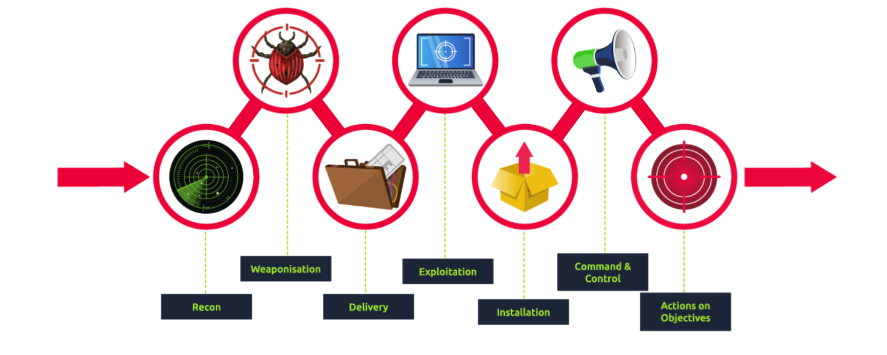

# Cyber Kill Chain

The Cyber Kill Chain framework is designed for identification and prevention of the network intrusions. You will learn what the adversaries need to do in order to achieve their goals.

he term kill chain is a military concept related to the structure of an attack. It consists of target identification, decision and order to attack the target, and finally the target destruction

**help you undertand end protect against:**
* APT 
* Ransomware Attacks
**Pheses Of Kill Chain**
* Reconnaissance
* Weponization
* Delivery 
* Explotation 
* Installation 
* Command & COntrol 
* ACtions on Objectives.

